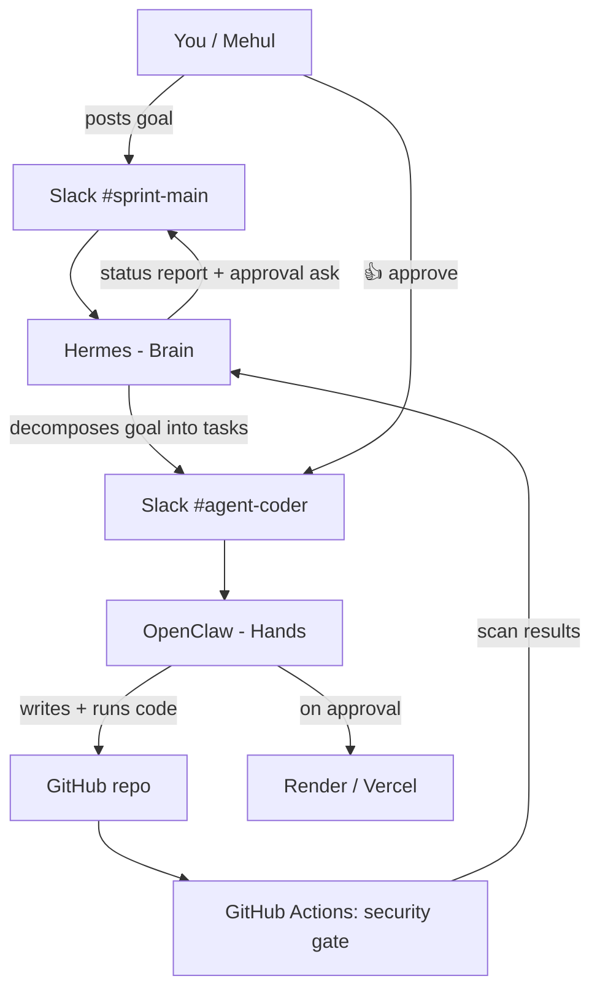
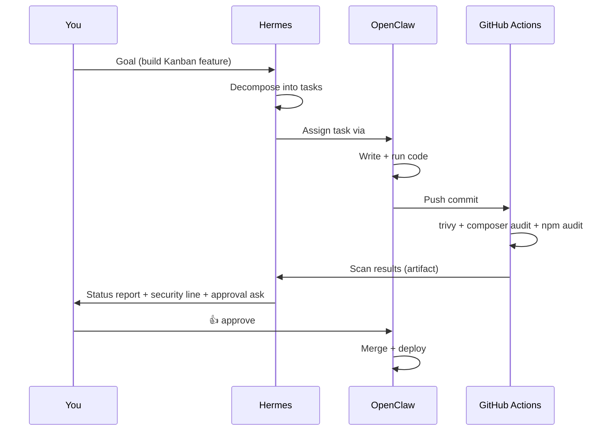

# 🏗️ Architecture — Helix

## System Overview

Helix is a multi-agent AI system built around two specialized agents — **Hermes** (the brain) and **OpenClaw** (the hands) — that collaborate asynchronously via Slack to plan, build, and ship software.

The agents built the Kanban application itself during the qualifier, demonstrating a real agentic software development loop.

---

## Agent Collaboration Flow



---

## Request Sequence



---

## Model Router

The model router (`agents/router.py`) directs each task type to the most capable available provider, with automatic failover if a provider rate-limits or goes down.

### Route Map

| Task Type | Primary | Fallback |
|-----------|---------|----------|
| `plan` | Groq / gpt-oss-120b | Gemini 2.5 Flash |
| `code` | Ollama / qwen2.5-coder | Groq / llama-3.3-70b |
| `summary` | Gemini 2.5 Flash | Ollama / qwen2.5-coder |
| `review` | Gemini 2.5 Flash | Groq / llama-3.3-70b |

### Why this routing?

- **Plan tasks** need the largest context window and best reasoning — GPT-oss-120b first, Gemini as a capable fallback.
- **Code tasks** benefit from Qwen2.5-Coder's specialization (runs locally via Ollama, zero latency, zero cost). Groq as a cloud fallback if Ollama is unavailable.
- **Summary/review tasks** favour Gemini's speed and large context for reading codebases.

### Failover Logic

```python
for provider, model in ROUTES[task_type]:
    try:
        response = POST(url, model=model, timeout=20s)
        if response.status == 200:
            log_call(...)       # appends to agent-log/events.jsonl
            return response
    except (HTTPError, Timeout, ConnectionError):
        continue                # try next provider
raise RuntimeError("all providers exhausted")
```

Every call is logged to `agent-log/events.jsonl` with provider, model, duration, and status. This feeds the live Audit Page at `/audit`.

---

## Human Approval Gate (Responsible AI)

Before any merge or deployment, OpenClaw posts a summary to `#agent-coder` and **waits for a 👍 reaction** (or `@Mehul approve` reply) before proceeding.

**Why this matters:**
- Prevents autonomous deployment of code that hasn't been reviewed
- Provides a clear audit trail (who approved, when)
- Satisfies regulatory requirements for "human-in-the-loop" AI systems
- Gives a concrete engineering answer to "what safeguards do your agents have?"

This is not a checkbox — it's a real async pause in the agent's execution loop.

---

## Kanban Application Architecture

```
Browser (React)
    ↕ HTTP (Bearer Token)
Laravel API (PHP 8.2)
    ↕ SQLite
    [boards] → [lists] → [cards] ↔ [tags]
                                  ↔ [users] (members)
```

### Database Schema

| Table | Key Columns |
|-------|-------------|
| `users` | id, name, email, password |
| `boards` | id, user_id, name |
| `lists` | id, board_id, name, position |
| `cards` | id, list_id, title, description, due_date, position |
| `tags` | id, name, color |
| `card_tag` | card_id, tag_id (pivot) |
| `card_user` | card_id, user_id (pivot) |

### API Surface (26 routes)

Authentication: Bearer token via Laravel Sanctum (`/api/login`, `/api/register`)

Boards: full CRUD + board detail with all lists/cards eager-loaded

Lists: scoped to board, orderable by position

Cards: full CRUD + move between lists (update `list_id`) + attach/detach tags and members

Agent Log: `GET /api/agent-log` reads `agent-log/events.jsonl` and returns parsed events + stats

---

## Security Architecture

Every `git push` triggers `.github/workflows/security.yml`:

1. **Composer audit** — checks PHP dependencies against the Packagist security advisory DB
2. **npm audit** — checks Node dependencies against the npm vulnerability DB  
3. **Trivy filesystem scan** — scans the entire repo for CVEs in dependencies and config files

Results are uploaded as GitHub Actions artifacts and reported by Hermes in the `#sprint-main` Slack channel in the Security Status section of the `status-report` skill.

---

## Deployment

| Service | Platform | URL |
|---------|----------|-----|
| Frontend | Vercel | https://helix-nine-lovat.vercel.app |
| Backend API | Render | https://helix-api.onrender.com |
| Local (Docker) | `docker compose up` | http://localhost:5173 |
